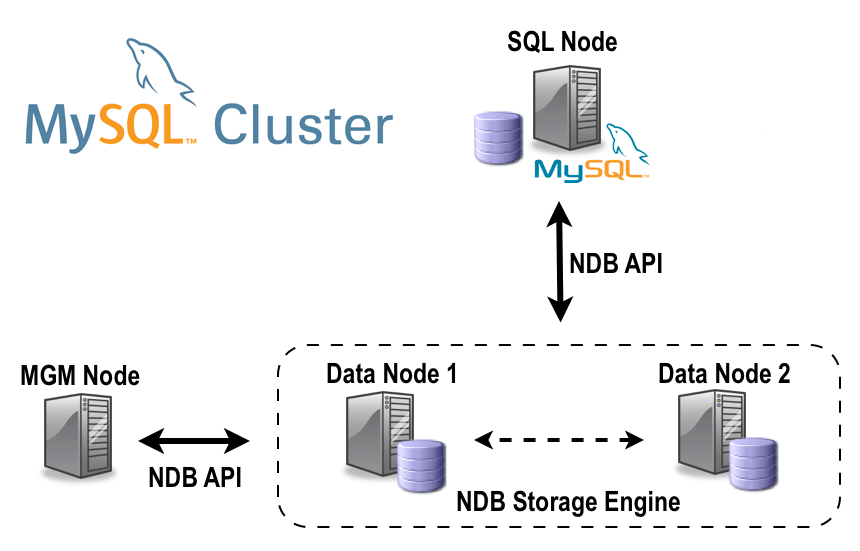

# NDB-CLUSTER-MYSQL (docker-compose)

This repository is created to simplify the setup of an NDB Cluster using Docker Compose.

This project is a fork of https://github.com/mlucasdasilva/cluster-mysql and has been modified to include several queries for generating binlog events.

You can use doc in mysql https://dev.mysql.com/doc/mysql-cluster-excerpt/8.0/en/mysql-cluster-quick.html
### NDB Cluster Info

- **Network [Docker Bridge (internal) network]**: 192.168.0.0/16 or 172.28.0.0/16
- **Nodes**: 
  - Management: 1
  - Data: 2
  - SQL: 1

### Attention

* Please verify and use the user information defined in the docker-compose file.
* Make sure to create tables in the bdteste database that is created alongside the cluster.
(Failure to use this specific database may result in specific binlog events not occurring.)
